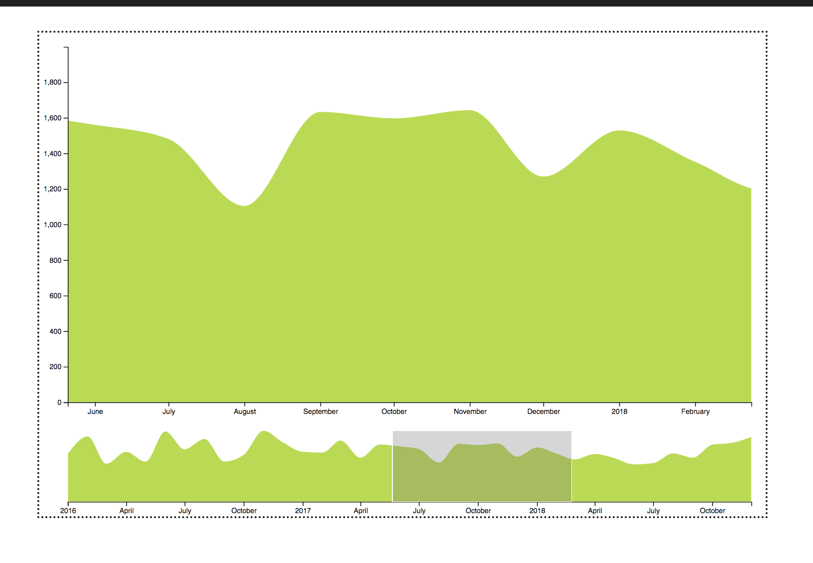

# Oppgave 4 - Zoombar Tidsserie

Denne oppgaven går ut på å ta disse dataene:

```javascript
const data = [
  {
    date: Date,
    price: float
  }
];
```

og presentere dem som en kontinuerlig tidsserie det går an å søke, flytte og zoome i.



Visualiseringen består av 2 deler:

1.  Et større område som viser et valgfritt utsnitt av dataene og som det går an å zoome i. Dette er også kjent som fokus-området.
2.  Et mindre område som viser alle dataene og hvilket utsnitt av dataene som er vist i fokus-området. Dette området kalles kontekst-området. Her kan du også flytte på utsnittet eller velge et nytt utsnitt ved å klikke og dra.

## Tips

- Vi benytter oss av to kjekke pakker fra D3 som kommer med ferdig funksjonalitet for utsnitt og zoom:
  - [Brush](https://github.com/d3/d3-brush) for å velge et utsnitt.
  - [Zoom](https://github.com/d3/d3-zoom) for å zoome i et datasett.
