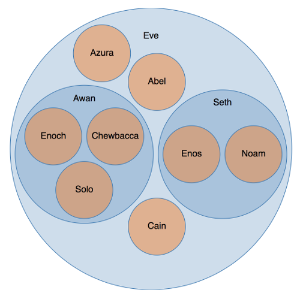

# Oppgave X - Hierarkiske data

Denne oppgaven går ut på å ta disse dataene:

~~~javascript
const data = {
  "name": "Eve",
  "children": [
    {
      "name": "Cain",
    },
    {
      "name": "Seth",
      "children": [
        {
          "name": "Enos"
        },
        {
          "name": "Noam"
        }
      ]
    },
    {
      "name": "Abel"
    },
    {
      "name": "Awan",
      "children": [
        {
          "name": "Enoch"
        },
        {
          "name": "Chewbacca"
        },
        {
          "name": "Solo"
        }
      ]
    },
    {
      "name": "Azura"
    }
  ]
};
~~~

og lage et circle packing diagram:

## Tips

* `d3-hierachy` kan brukes for hierarkiske grafer, circle packing, partisjoneringer, sun burst diagram og mye annet snacks: https://github.com/d3/d3-hierarchy