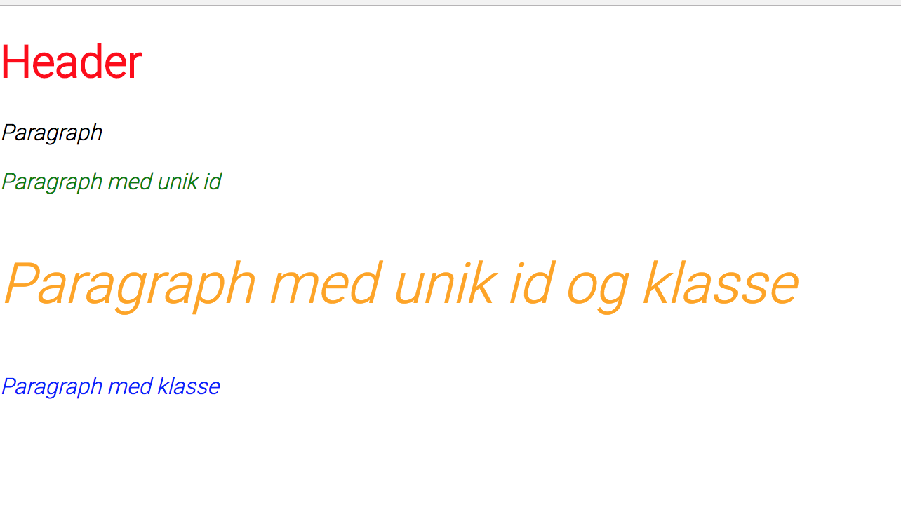

# d3.select

Å velge elementer er viktig for å programmere med d3, da man ikke kan gjøre så mye uten de. Før man endrer eller modifiserer elementer i d3 må man velge de (derav `select`). Dette kan bli gjort ved å bruke enten `d3.select(this)` eller `d3.selectAll(this)`, hvor `this` er det/de spesifikke elementene du ønsker å velge. `.select()` vil kun velge første forekomst som passer til kriteriet man spesifiserer. `.selectAll()` vil velge alle elementer som passer til kriteriet man spesifiserer og returnere det som et array av elementer.

Man kan velge elementer på følgende måter:

* Tag

```javascript
d3.select("div");
```

* Class

```javascript
d3.select(".classname");
```

* Unique identifier

```javascript
d3.select("#id");
```

* Attribute

```javascript
d3.select("[color=black]");
```

Man kan også dra nytte av AND og OR operartorer. For å velge et element som oppfyller minst et av to kriterer kan man sette de side om side, mens hvis man ønsker å velge et element hvor begge kriterene stemmer kan man sette et komma mellom de som nedenfor:

* AND

```javascript
d3.select(".this.that");
```

* OR

```javascript
d3.select(".this,.that");
```

Hvis man ønsker kan man kombinere flere `select()`. For eksempel, så kan man velge første "bold" element i hver paragraf med følgende kode:

```javascript
d3.selectAll(“p”).select(“b”)
```

# Utdelt oppsett

Boilerplate-koden som trengs for å få bygd en d3-visualisering i nettleseren er allerede satt opp i denne mappen. Du vil mest sannsynlig skrive mesteparten av koden din i `src/index.js` hvor det står `// ENTRY POINT FOR D3`.

Åpne opp `src/index.html` i nettleseren og refresh siden for å se endringene du har gjort.

# Oppgaver

Nå skal vi bli kjent med `d3.select`, og vi skal bruke det til å endre stylingen på følgende html med `.style()`-metoden.

```html
<body>
  <h1>Header</h1>
  <p>Paragraph</p>
  <p id="paragraph">Paragraph med unik id</p>
  <p class="paragraph" id="paragraph">Paragraph med unik id og klasse</p>
  <p class="paragraph">Paragraph med klasse</p>
</body>
```

`.style()` tar to argumenter og må bli kalt på en selection. Første argument er css-verdien som skal endres og andre argument er den faktiske verdien.

```javascript
selection.style("CSS Style string", new value());
```

1. Endre headeren sin tekstfargen til rød.
2. Endre alle paragrafer til `italic`
3. Gi paragrafen `<p class="paragraph">Paragraph med klasse</p>` tekstfargen blå.
4. Gi paragrafen `<p id="paragraph">Paragraph med id</p>` tekstfargen grønn.
5. Gi paragrafen `<p class="paragraph" id="paragraph">Paragraph med unik id og klasse</p>` tekstfargen oransje og skriftstørrelse 40px.

Etter å ha fullført de 5 oppgavene vil du ende opp med følgende i nettleseren.


