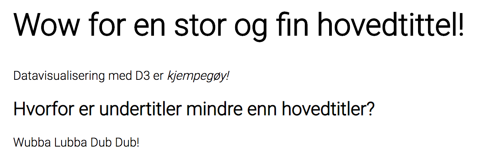

# Oppgave 1 - Å lage elementer

I forrige oppgave lærte vi å bruke `d3.select` til å få tak i elementer i html-strukturen slik at vi kunne endre egenskapene på dem. Med d3 er det også mulig å _legge til_ nye elementer, og det er det vi skal leke oss med i denne oppgaven!

## Legge til elementer med `d3.append()` og `d3.insert()`
La oss si vi har et html-dokument med en tom `<body>` som vi ønsker å fylle med innhold:
```html
...
<body>
    // ønsker å legge til noe greier her
</body>
...
``` 
 
 
 Hvis vi ønsker å fylle `<body>`-en med spennende ting kan vi oppnå dette med funksjonen [`d3.append()`](https://github.com/d3/d3-selection#selection_append) eller [`d3.insert()`](https://github.com/d3/d3-selection#selection_insert). Append vil legge til et nytt element på slutten av elementet du har valgt med `d3.select()`, mens med insert kan du spesifisere mer nøyaktig hvor du vil sette inn det nye elementet. Hvis vi vil legge til en `<article>` i `<body>`-en vår, kan vi for eksempel skrive 

```javascript
d3.select('body').append('article');
```

Resultatet blir at vi nå får en `<article>` inne i `<body>`-en slik som dette:

```html
<body>
    <article></article>
</body>
```

Pretty sweet! Vi kan legge til så mange elementer vi vil. For å appende tekst på et element kan vi bruke `d3.text("Din tekst")`, for eksempel slik som dette:

```javascript
d3.select('article').text('Litt tekst inni artikkelen vår');

/* resultat:
<body>
    <article>Litt tekst inni artikkelen vår</article>
</body>
```

Måten man bruker `d3.append()` og `d3.insert()` påvirker hierarkiet av elementer:

```javascript
let myDiv = d3.select("div");

myDiv
  .append("foo")
  .append("foo")
  .append("foo");

/* resultat:
<div>
    <foo>
        <foo>
            <foo />
        </foo>
    </foo>
</tr>
*/
```

```javascript
myDiv.append("foo");
myDiv.append("foo");
myDiv.append("foo");

/* resultat:
<div>
    <foo />
    <foo />
    <foo />
</tr>
*/
```

## :trophy: Din oppgave

En artikkel på web er typisk strukturert med en `<article>`-tag ytterst som omslutter innholdet i artikkelen. Innholdet deles gjerne inn i hovedoverskrift (`<h1>`), ulike seksjoner (`<section>`), underoverskrifter (`<h2>`, `<h3>` osv.), paragrafer (`<p>`), uthevet tekst i bold eller italic (`<b>` eller `<i>`) osv..

Din oppgave blir å konstruere en simpel artikkel med d3 og oppnå et resultat ca sånn som dette:



Html-en bør se ca sånn ut:
```html
<body>
    <article>
        <h1>
            Wow for en stor og fin hovedtittel!
        </h1>
        <p>
            Datavisualisering med D3 er <i>kjempegøy!</i>
        </p>
        <h2>
            Hvorfor er undertitler mindre enn hovedtitler?
        </h2>
        <p>
            Wubba Lubba Dub Dub!
        </p>
    </article>
</body>
```

💡 Tips! Du kan inspisere hvordan nettleseren din tolker html-strukturen på en side ved å høyreklikke et sted på siden og velge _Inspiser_! Dette kan være nyttig hvis du vil verifisere om html-en du genererer med d3 blir som du har tenkt. Inspiser er forøvrig en frontend-utviklers beste venn, og brukes ofte flittig til feilsøking og testing under utvikling av nye web-grensesnitt.


:school_satchel: [Fasit](./src/fasit.js)