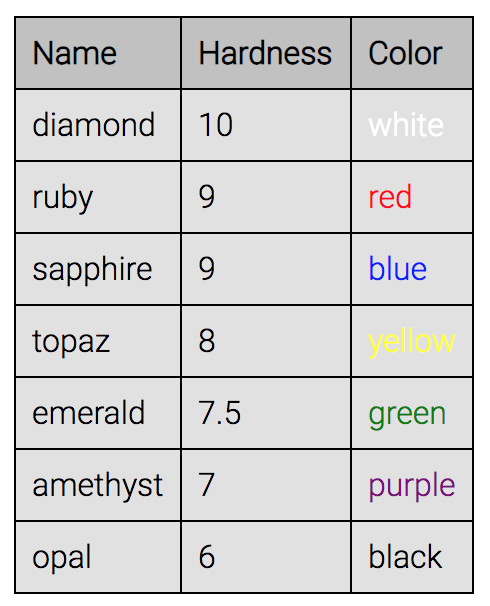

# Oppgave 1 - Helt grunnleggende databinding

## Databinding

Vanligvis når man ønsker å lagre en verdi i et programmeringsspråk blir det gjort ved å tilordne en verdi til en variabel.

Hvis man ønsker å lagre verdiene 1, 2, 3 og 4 i et array initialiserer man variabelen og tilordner verdien på følgende måte:

```javascript
const myArray = [1, 2, 3, 4];
```

I d3 lagrer man ikke data i variabler. Istedenfor lagrer d3 data i DOM-selectorer ved å kalle på `selection.data()`-metoden.

`.data()`-metoden må bli kalt på en selection og tar et array av verdier som argument.

```javascript
selection.data([array]);
```

Når `.data()` blir kalt slår den sammen arrayet av verdier med arrayet av elementer (selection) som den blir kalt på. Første verdien i arrayet vil bli slått sammen med første element i selection.

> _En selection vil alltid være et array av elementer. Dette gjelder for både `select()` og `selectAll()`_

`.data()` returnerer et d3-objekt som representerer verdiene fra arrayet som blir gitt som argument. Dette kan man bruke til å endre attributter og styling på elementer ved å kjede metoder.

La oss si at vi har fem sirkler:

```html
<div id="data_example1">
  <svg width="375" height="100">
    <circle id = "myCircle" cx="30" cy="50" r="30" ></circle>
    <circle id = "myCircle" cx="100" cy="50" r="30" ></circle>
    <circle id = "myCircle" cx="170" cy="50" r="30" ></circle>
    <circle id = "myCircle" cx="240" cy="50" r="30" ></circle>
    <circle id = "myCircle" cx="310" cy="50" r="30" ></circle>
  </svg>
</div>
```

Og at vi ønsker at sirklene skal ha de forskjellige radiusene vi har definert i `radiusData`:

```javascript
const radiusData = [10, 15, 20, 25, 30];
```
I kodesnutten under vil kallet på `.data()` slå sammen verdiene i `radiusData` med sirklene, og gi oss et d3-objekt som inneholder sammenslåingen tilbake. Deretter bruker vi `.attr()` til å endre på radiusen til hver sirkel i objektet.

```html
<div id="data_example1">
  <svg width="375" height="100">
    <circle id = "myCircle" cx="30" cy="50" r="30" ></circle>
    <circle id = "myCircle" cx="100" cy="50" r="30" ></circle>
    <circle id = "myCircle" cx="170" cy="50" r="30" ></circle>
    <circle id = "myCircle" cx="240" cy="50" r="30" ></circle>
    <circle id = "myCircle" cx="310" cy="50" r="30" ></circle>
  </svg>
</div>
<script type="text/javascript">
  const radiusData = [10, 15, 20, 25, 30];
  const selectExample = d3.select("#data_example1");

  selectExample.selectAll("circle")
    .data(radiusData)
    .attr("r", function(d){return d});
</script>
```

## Funksjonene enter() og append()

I eksempelet over hardkodet vi `circle`-elementene i html. Selv om dette er nyttig til å forklare d3, er det ikke alltid mulig å gjøre endringer i html-koden. Hvis man for eksempel ønsker å endre sirkelene til andre `svg`-elementer må man gjøre det linje for linje.

Vi kan forbedre koden ved å bruke d3 til å generere og legge til elementer til DOMen. I dette eksempelet vil vi bruke `.enter()` og `.append()` til å legge til `circle`-elementer.

> _`.enter()` kan kun bli brukt etter et `.data()`-kall og brukes til å indikere at nye elementer vil bli lagt til i nåværende selection. Et `.append()` eller `.insert()`-kall følger alltid et `.enter()`-kall_

> _`.append()` brukes til å legge til elementer til DOMen. Man kan legge til `<p>`, `<div>`, text, `<svg>`-elementer osv._

```html
<div id="data_example"></div>
```

```js
const circleData = [10, 15, 20, 25, 30];

// Legger til et svg-element
const selectDiv = d3.select("#data_example")
  .append("svg")
  .attr("width", circleData.length * 100)
  .attr("height", 100);

// Legger til en sirkel for hvert element i circleData
selectDiv.selectAll("circle")
  .data(circleData)                        // Binder data
  .enter()
  .append("circle")                        // Legger til sirkel
  .attr("cx", function(d){return d[0]*14}) // x-posisjon
  .attr("cy", 50)                          // y-posisjon
  .attr("r", function(d){return d[0]})     // radius fra circleData
  .style("fill", "black");
```


## :bulb: Tips

* D3 trenger ikke nødvendigvis å brukes til å binde `svg`-elementer. I denne oppgaven skal de bindes til en vanlig [HTML-tabell](https://developer.mozilla.org/en-US/docs/Learn/HTML/Tables/Basics) `<table>`

* For å lage en `<tr>` i tabellen for hvert innslag i dataene gjør man altså:

```javascript
const dataTR = d3
  .select(table)
  .selectAll("tr")
  .data(data)
  .enter()
  .append("tr");
```

* For å appende bare tekst, og ikke et DOM-element, bruk `.text((d, i) => "en tekst")`

* D3 kommer med mange nyttige verktøy for datavisualiseringsrelaterte oppgaver. F.eks. `format(<format>)`: https://github.com/d3/d3-format#d3-format

* Måten man bruker `.append` påvirker hierarkiet av elementer:

```javascript
dataTR
  .append("foo")
  .append("foo")
  .append("foo");

/* resultat:
<tr>
    <foo>
        <foo>
            <foo />
        </foo>
    </foo>
</tr>
*/
```

```javascript
dataTR.append("foo");
dataTR.append("foo");
dataTR.append("foo");

/* resultat:
<tr>
    <foo />
    <foo />
    <foo />
</tr>
*/
```

## :trophy: Din oppgave

Oppgaven går ut på å ta disse dataene:

```javascript
const data = [
  { name: "diamond", hardness: 10, color: "white" },
  { name: "ruby", hardness: 9, color: "red" },
  { name: "sapphire", hardness: 9, color: "blue" },
  { name: "topaz", hardness: 8, color: "yellow" },
  { name: "emerald", hardness: 7.5, color: "green" },
  { name: "amethyst", hardness: 7, color: "purple" },
  { name: "opal", hardness: 6, color: "black" }
];
```

og få dette resultatet:



Legg merke til nummerformateringen og fargene. Oppgaven er ferdig når du synes at ditt resultat er likt nok.

:school_satchel: Se [fasit](https://github.com/bekk/intro-til-d3/blob/master/oppgaver/1-table/src/fasit.js) for en mulig løsning og ekstra hint. Det er viktig å huske at det er som regel veldig mange forskjellige måter å lage samme visualisering på.
