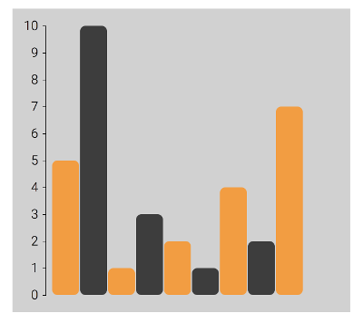

# Oppgave 2 - Bar chart i SVG

Denne oppgaven går ut på å ta disse enkle dataene:

```javascript
const data = [5, 10, 1, 3, 2, 1, 4, 2, 7];
```

og få dette resultatet:



Legg merke til y-aksen og fargene. Oppgaven er ferdig når du synes at ditt resultat er likt nok.

## Utdelt oppsett og fasit

Oppsettet er stort sett slik som forrige oppgave `1-table`. Er ikke det praktisk?

## Tips

* I stedet for å regne ut posisjonen til alle stolpene for hånd kan man bruke `d3.scaleLinear()` fra modulen `d3-scale`. Alle modulene er godt forklart i sin dokumentasjon: https://github.com/d3/d3-scale#continuous-scales

* For å lage en akse med etiketter bør man bruke `d3-axis`. For eksempel `d3.axisLeft(scale)` som tar en skala fra `d3-scale` som argument, og returnerer en generator-funksjon som bygger en ferdig akse. Se dokumentasjonen på https://github.com/d3/d3-axis

* For å bruke en generator-funksjon på en SVG kan man legge til en gruppe `<g>` og kalle generatoren for å fylle den gruppa med elementer:

```javascript
const yAxis = d3.axisLeft(myScale);

d3
  .select(svg)
  .append("g")
  .call(yAxis);
```
