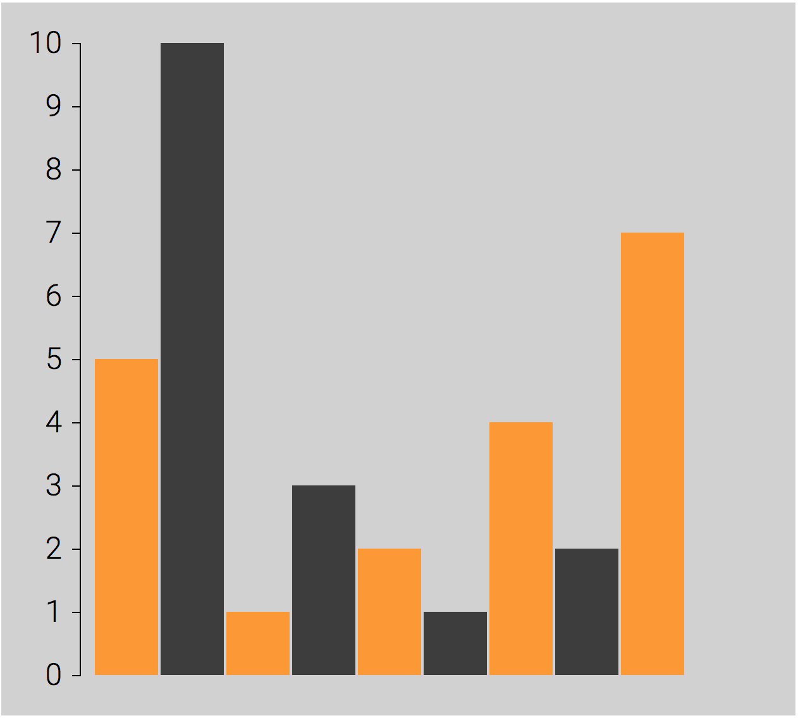
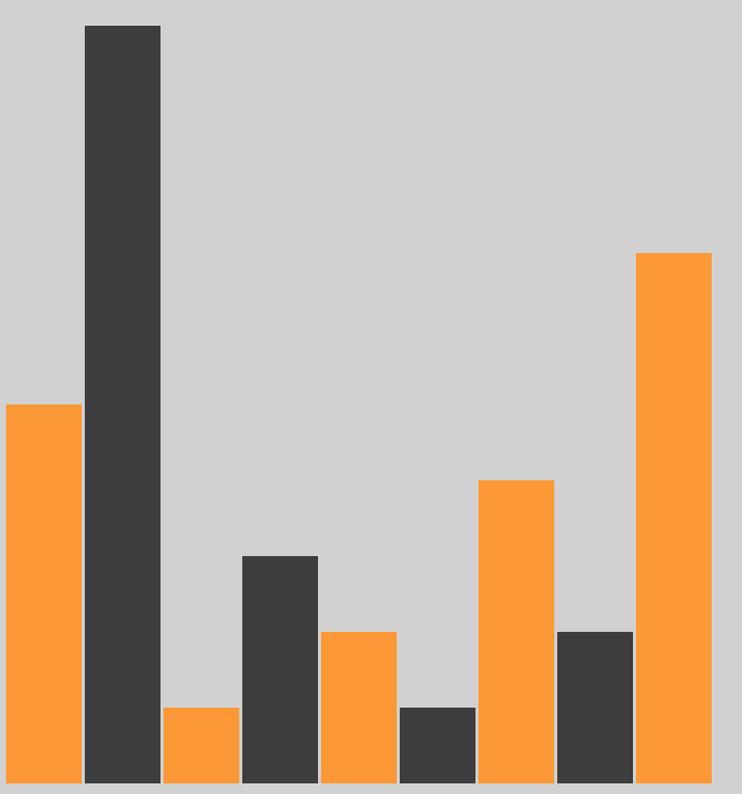

# Oppgave 2 - Bar chart i SVG

Nå skal vi ta disse enkle dataene:

```javascript
const data = [5, 10, 1, 3, 2, 1, 4, 2, 7];
```

og få dette resultatet:



## Utdelt oppsett og fasit

Oppsettet er stort sett slik som forrige oppgave `1-table`. Er ikke det praktisk?

### Del 1

Vi starter med å lage søylene. Disse lager vi med å legge til et [rect](https://developer.mozilla.org/en-US/docs/Web/SVG/Element/rect) i svg'en vår for hvert element i data.

```javascript
const graph = d3
  .select(svg)
  .selectAll("rect")
  .data(data)
  .enter()
  .append("rect");
```

I stedet for å regne ut posisjonen til alle stolpene for hånd kan man bruke `d3.scaleLinear()` fra modulen `d3-scale`. Alle modulene er godt forklart i sin dokumentasjon: https://github.com/d3/d3-scale#continuous-scales

:trophy: Disse rektangelene skal du nå få til å se ut som nedenfor ved å bruke `.style()` og `attr()` til å style og sette attributer på hvert rektangel i `graph`.



:bulb: `style()` brukes til å legge til css-verdier på et element

:bulb: `attr()` brukes til å sette attributer på et element. Man vil feks sette bredden på alle rektangeler i `graph` ved å skrive følgende:

```javascript
graph.attr("width", "200");
```

### Del 2

Fornøyd med resultatet? Sweet, la oss legge til en y-akse på venstre side.

For å lage en akse med etiketter bør man bruke `d3-axis`. For eksempel `d3.axisLeft(scale)` som tar en skala fra `d3-scale` som argument, og returnerer en generator-funksjon som bygger en ferdig akse. Se dokumentasjonen på https://github.com/d3/d3-axis

For å bruke en generator-funksjon på en SVG kan man legge til en gruppe `<g>` og kalle generatoren for å fylle den gruppa med elementer:

```javascript
const yAxis = d3.axisLeft(myScale);

d3
  .select(svg)
  .append("g")
  .call(yAxis);
```

:trophy: Legg til en akse på venstre siden av grafen.


:bulb: Man kan snu en scale ved å gi `.range()` andre verdier.

:school_satchel: [Fasit](https://github.com/bekk/intro-til-d3/blob/master/oppgaver/2-barchart/src/fasit.js)
