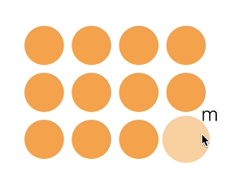

# Oppgave 3 - Interaksjon og animasjon

## Transition

Overganger fra en tilstand til en annen gjøres altså med å legge ting etter `.transition()`. For å f.eks. endre farge fra svart til rød over et halvt sekund:

```javascript
element
  .attr("fill", "#000000")
  .transition()
  .duration(500)
  .attr("fill", "#ff0000");
```

## Eventer

Man kan lytte på handlinger som ´mouseover´og ´mouseout´ ved å bruke `.on()`. Se dokumentasjonen på https://github.com/d3/d3-selection#handling-events

```javascript
element.on("mouseover", handleMouseOver).on("mouseout", handleMouseOut);
```

Callback-funksjonen til `.on()` tar data og indeks som parametere, og `this` er selve elementet som hadde eventet:

```javascript
function handleMouseOver(d, i) {
  d3
    .select(this) // this er dom-elementet som hadde mouse over
    .style("fill", "red");
}
```

## Din oppgave

Denne oppgaven går ut på å ta disse dataene:

```javascript
const data = [
  { name: "a" },
  { name: "b" },
  { name: "c" },
  { name: "e" },
  { name: "f" },
  { name: "g" },
  { name: "h" },
  { name: "i" },
  { name: "j" },
  { name: "k" },
  { name: "l" },
  { name: "m" }
];
```

og lage en animert visualisering man kan interagere med:



Når musen kommer over en sirkel utvider den seg sakte og viser navnet sitt. Når musen går ut forsvinner navnet og sirkelen går sakte tilbake til sin gamle størrelse.

:trophy: Oppgave 1: 

Vi starter med å lage `handleMouseOver` funksjonen. Når man holder over en sirkel skal den utvide seg sakte, endre farge og vise navnet sitt med en `transition`.

:bulb: Man kan utvide sirkelen ved å øke attributten `r` (radius) og endre fargen ved å endre `fill` attributten.

:bulb: Man kan legge til teksten ved å appende et `text`-element til SVGen.

:bulb: De utdelte funksjonene `xCoord(d, i)` og `yCoord(d, i)` kan brukes til å finne x og y posisjonen til et element.


Nå burde vi ha sirkeler som utvider seg og viser navnet sitt når man holder musepekeren over de. Det eneste problemet er at de ikke endrer tilstand tilbake til sin opprinnelige tilstand når musepekeren ikke er over elementet lenger.

:trophy: Oppgave 2: 

Implementer `handleMouseOut` funksjonen. Denne skal tranformere sirkelen tilbake til opprinnelig tilstand og fjerne teksten. 

:bulb: Man kan fjerne et element med `.remove()`.


:school_satchel: [Fasit](https://github.com/bekk/intro-til-d3/blob/master/oppgaver/3-interaction-animation/src/fasit.js)

