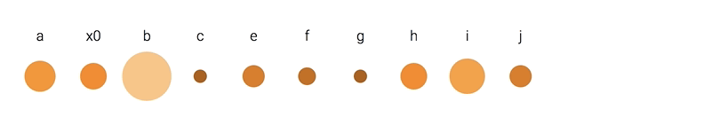

# Oppgave 4 - Bonus

## Dynamisk data

For å håndtere animasjoner på dynamiske data må general update pattern benyttes med join, enter, update og exit: https://github.com/d3/d3-selection#joining-data

## Din oppgave

:trophy: Denne oppgaven går ut på å ta disse dataene:

```javascript
const data = [
  { name: "a", value: 5 },
  { name: "b", value: 10 },
  { name: "c", value: 1 },
  { name: "e", value: 3 },
  { name: "f", value: 2 },
  { name: "g", value: 1 },
  { name: "h", value: 4 },
  { name: "i", value: 2 },
  { name: "j", value: 7 }
];
```

og håndtere at dataene endrer seg kontinuerlig. Det vil bli lagt til nye data, data vil blir fjernet, og eksisterende data vil få nye verdier. Alt skal animeres slik at resultat blir slik:



Hver sirkel har en fargenyanse og størrelse iht til sin verdi, og den har navnet sitt over seg. Ved endret verdi animeres endring i sirkelens størrelse. Ved fjerning og tillegging av data animeres translasjonen til nye posisjoner.

:bulb: Oppsettet i den utdelte koden kaller `updateChart()` både under oppstart, og på nytt hver gang data endrer seg. Slik vil D3 kunne oppdatere og animere visualiseringen.

:bulb: For å lage forskjellige nyanser av en farge, er det enklere å bruke HSL-fargemodellen i stedet for RGB: `fill="hsl(32, 100%, 50%)"`. Les mer på https://www.w3schools.com/colors/colors_hsl.asp

:school_satchel: [Fasit](https://github.com/bekk/intro-til-d3/blob/master/oppgaver/4-dynamic-data/src/fasit.js)
